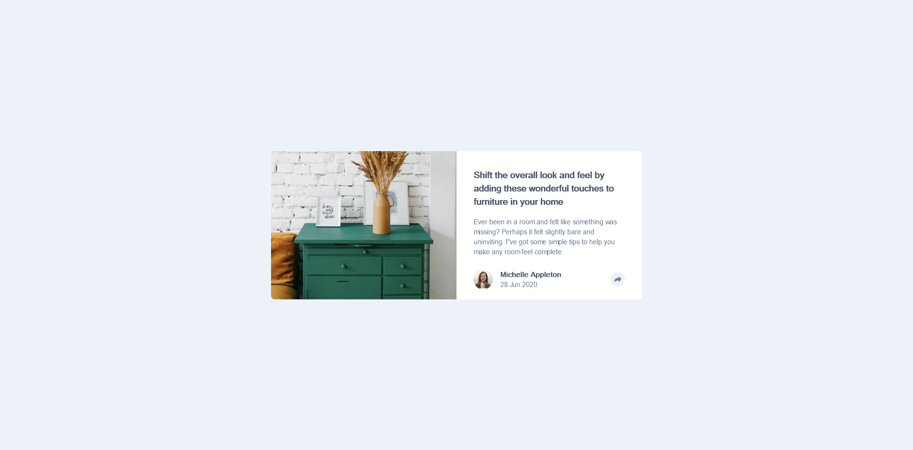

# Frontend Mentor - Article preview component solution

This is a solution to the [Article preview component challenge on Frontend Mentor](https://www.frontendmentor.io/challenges/article-preview-component-dYBN_pYFT). Frontend Mentor challenges help you improve your coding skills by building realistic projects. 

## Table of contents

- [Overview](#overview)
  - [The challenge](#the-challenge)
  - [Screenshot](#screenshot)
  - [Links](#links)
- [My process](#my-process)
  - [Built with](#built-with)
  - [What I learned](#what-i-learned)
  - [Continued development](#continued-development)
  - [Useful resources](#useful-resources)
- [Author](#author)

## Overview

### The challenge

Users should be able to:

- View the optimal layout for the component depending on their device's screen size
- See the social media share links when they click the share icon

### Screenshot

### Links

- Solution URL: [Solution URL here](https://github.com/awesooomeME/article_preview)
- Live Site URL: [Live site URL here](https://article-preview-beta-one.vercel.app/)

## My process

### Built with

- Semantic HTML5 markup
- CSS custom properties
- Flexbox
- [React](https://reactjs.org/) - JS library
- [Next.js](https://nextjs.org/) - React framework
- [Tailwind](https://https://tailwindcss.com//) - For styles
- [Styled Components](https://styled-components.com/) - For styles

**Note: These are just examples. Delete this note and replace the list above with your own choices**

### What I learned

I think I've done a great job on this solution compared to my previous solutions. I've finally got rid off
excessively using divs and h1 for my html content. And have used proper html tags for each use. Although
I still think there are a lot to improve, this is a great step for me.

My CSS (tailwind) has also been more responsive thanks to an approach done by Kevin Powell.

### Continued development

### Useful resources

- [resource 2](https://www.youtube.com/@KevinPowell)
    - Great YouTube channel for all things CSS

- [resource 1](https://livebook.manning.com/book/next-js-in-action/welcome/v-2/) 
    - Great book for React introduction

- [resource 3](https://www.joshwcomeau.com/css/custom-css-reset/)
    - CSS Reset that I used

## Author

- Github - [awesooomeME](https://github.com/awesooomeME)
- Frontend Mentor - [@awesooomeME](https://www.frontendmentor.io/profile/awesooomeME)
